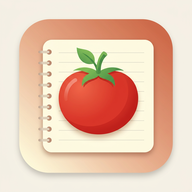
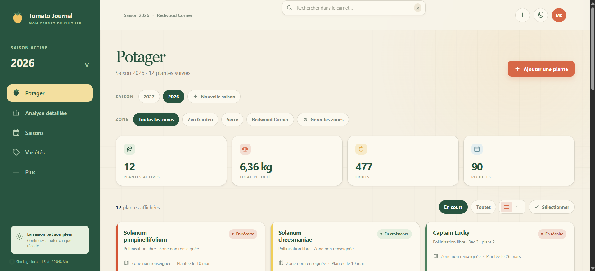
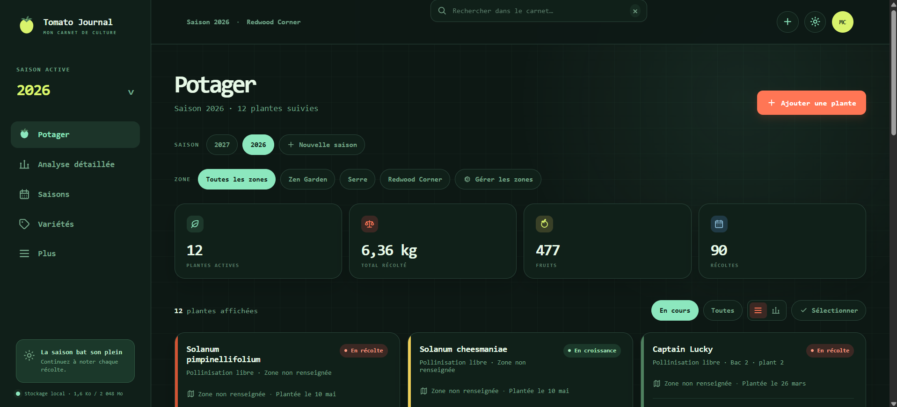
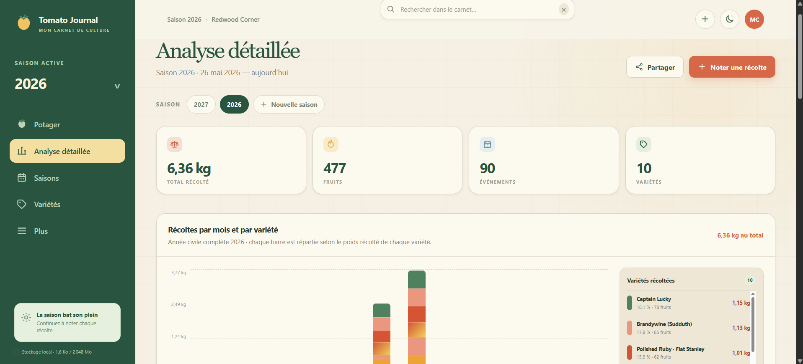
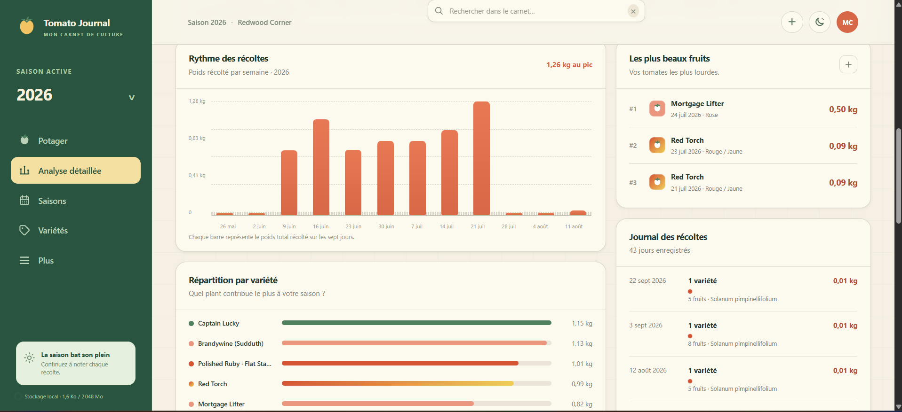
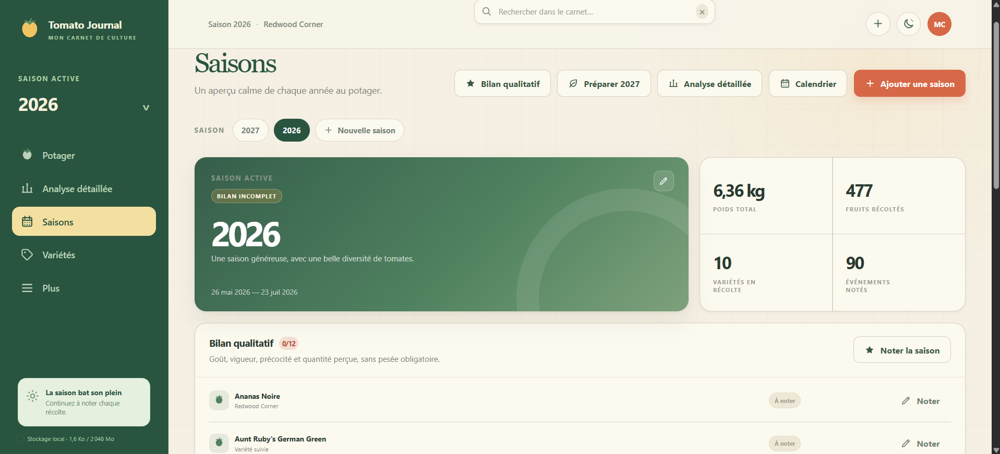
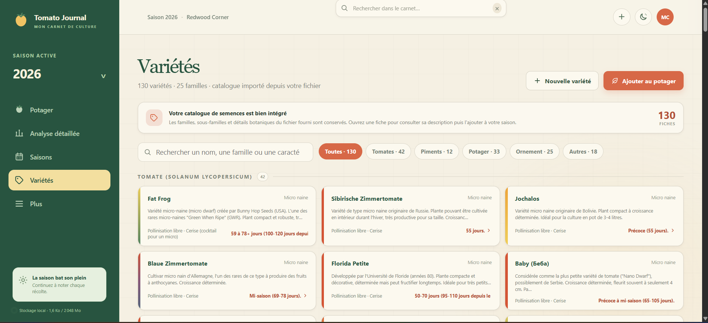
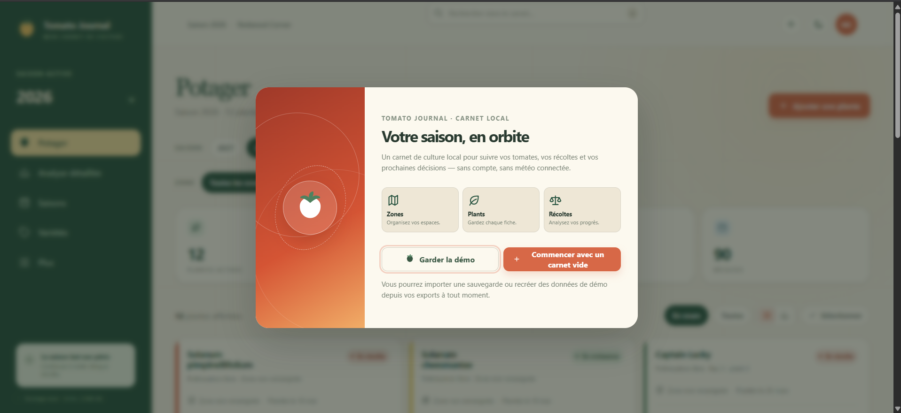

<div align="center">



# 🍅 Tomato Journal

**Le carnet de culture de tomates qui vit entièrement dans votre navigateur.**<br/>
*The tomato growing journal that lives entirely in your browser.*

<br/>

<a href="#-français"></a>
&nbsp;
<a href="#-english"></a>

<br/><br/>


<br/><br/>

<table>
<tr>
<td width="50%" align="center">
<br/>
<sub><b>☀️ Bio-Orbital</b> — thème clair</sub>
</td>
<td width="50%" align="center">
<br/>
<sub><b>🌙 Night Garden HUD</b> — thème sombre</sub>
</td>
</tr>
</table>

</div>

---

<div align="center">

### ⚡ Démarrage en 10 secondes · Get started in 10 seconds

</div>

```bash
npm start          # puis / then → http://localhost:4173
```

<div align="center">
<sub>Pas de npm ? · No npm? &nbsp;→&nbsp; <code>python3 -m http.server 4173</code></sub>
</div>

---

<a id="-français"></a>

<div align="center">

# 🇫🇷 Français

<sub>🇬🇧 <a href="#-english">Switch to English</a></sub>

</div>

## 🌱 En bref

<table>
<tr>
<td width="33%" valign="top" align="center">

### 🔒
**Aucun compte**

Aucun serveur, aucun appel réseau. Tout reste dans le `localStorage` et l'IndexedDB du navigateur.

</td>
<td width="33%" valign="top" align="center">

### 📦
**Zéro dépendance**

HTML, CSS et JavaScript natifs. Rien à installer, rien à compiler.

</td>
<td width="33%" valign="top" align="center">

### 📱
**Installable (PWA)**

S'installe sur ordinateur, Android et iPhone, et fonctionne hors ligne.

</td>
</tr>
</table>

---

## ✨ Fonctionnalités

<details open>
<summary><b>🪴 Potager, zones et fiches plantes</b></summary>

<br/>

| | |
|---|---|
| **Potager** | Plantes, zones, filtres et affichage grille/liste. |
| **Zones** | Ajout, renommage et suppression depuis *Potager* ou *Plus*. |
| **Sécurité** | Les actions destructives demandent une **double confirmation**. |
| **Fiche plante** | Variété, caractéristiques, emplacement et notes. |
| **Actions groupées** | Le bouton « Sélectionner » applique un statut, une zone, l'archivage, la comparaison ou une suppression à plusieurs plantes. |

<div align="center">
<br/>
<sub><i>Le Potager en thème clair <b>Bio-Orbital</b> : statistiques de la saison, filtres par zone et cartes des plantes.</i></sub>
</div>

</details>

<details>
<summary><b>📊 Analyse détaillée et récoltes</b></summary>

<br/>

- Récoltes, rythmes, répartitions, rendements par zone et comparaison des saisons au même endroit.
- **Graphique annuel** : douze mois en barres empilées par variété — la hauteur représente le poids récolté et chaque segment reprend la couleur de la fiche concernée.
- Les poids acceptent les **décimales en grammes** (par exemple 1 200,5 g) et restent pris en compte dans tous les totaux et moyennes.
- Rendements par plant et par zone, moyennes, meilleure journée et note gustative moyenne.
- Les fenêtres longues de planification et de budget restent défilables sur ordinateur comme sur mobile.

<div align="center">
<br/>
<sub><i>Graphique annuel : douze mois en barres empilées par variété.</i></sub>
<br/><br/>
<br/>
<sub><i>Rythme hebdomadaire, répartition par variété, plus beaux fruits et journal des récoltes.</i></sub>
</div>

</details>

<details>
<summary><b>🗓️ Tâches, calendrier et rappels</b></summary>

<br/>

- **Tâches** : arrosage, fertilisation, tuteurage, échéance, répétition, quantité/dosage et détails.
- **Calendrier de culture** : plantations, maturités estimées, tâches et jours de récolte.
- **Rappels** calculés depuis la date de plantation et les jours de maturité de chaque fiche.
- **Comparaison** : tableau entre plants avec poids, fruits, précocité et goût.

</details>

<details>
<summary><b>🏆 Saisons, bilans et dégustations</b></summary>

<br/>

- **Notes gustatives** : saveur, sucrosité, acidité, texture, note globale et commentaires.
- **Saisons** : résumé annuel, état du bilan (en cours, incomplet ou clôturé) et moments à retenir.
- **Bilan qualitatif** : goût, vigueur, précocité, quantité perçue et décision *retenir / revoir / écarter*, sans pesée obligatoire.
- **Comparaison de saisons** : rendement, variétés productives, zones, notes gustatives et budget année par année.
- **Bilan partageable** : carte visuelle, badges, indice potager, records et défi amical, avec copie du texte, partage natif et téléchargement de la carte SVG.

<div align="center">
<br/>
<sub><i>La page Saisons : résumé de l'année, état du bilan et bilan qualitatif variété par variété.</i></sub>
</div>

</details>

<details>
<summary><b>🌾 Catalogue, semences, croisements et planification</b></summary>

<br/>

- **Catalogue de variétés** : 40 fiches, avec noms des variétés et détails botaniques conservés ; recherche, filtres, consultation, ajout de variétés et ajout prérempli au potager. Le formulaire « Ajouter une plante » propose aussi un menu déroulant du catalogue.
- **Photos catalogue** : chaque fiche peut recevoir une photo de référence locale, stockée dans IndexedDB et incluse dans les sauvegardes.
- **Inventaire de graines** : stocks restants, unités, achat/récolte, viabilité, emplacement, source, notes et candidate associée. Les candidates « à acheter » sans stock sont signalées.
- **Candidats et achats** : liste séparée pour la saison suivante — *candidate, à acheter, achetée, semée, plantée, retenue, écartée* — avec priorité, quantité et notes.
- **Croisements et lignées** : parents femelle/mâle, génération F1/F2/F3, dates de pollinisation et d'extraction, quantité de graines, plants sélectionnés, caractères recherchés et stabilité. Chaque lignée peut alimenter le catalogue local et les candidats de saison.
- **Planification** : sélection pour la prochaine saison et recommandations basées sur les performances actuelles.

<div align="center">
<br/>
<sub><i>Le catalogue : 40 fiches de tomates réparties en 4 sous-familles, avec recherche et filtres.</i></sub>
</div>

</details>

<details>
<summary><b>📷 Photos, santé des plants et budget</b></summary>

<br/>

- **Journal photo** : photos compressées et conservées localement avec titre, date et observation.
- **Suivi sanitaire** : symptômes structurés, gravité, traitement, date, évolution, notes et photo associée. Historique modifiable, exporté pour l'IA et restaurable.
- **Budget du potager** : dépenses par catégorie, variété et zone, coût par kilogramme, ventilation par zone, prix commercial de référence, économies estimées et projection de la saison suivante.
- **Carte imprimable** : *Plus → Carte imprimable* affiche les zones et les plants, avec impression navigateur ou « Enregistrer au format PDF ».

</details>

<details>
<summary><b>🎨 Thèmes et palette des fruits</b></summary>

<br/>

| Thème | Mode |
|---|---|
| **Bio-Orbital** | ☀️ Clair |
| **Night Garden HUD** | 🌙 Sombre |

Bascule rapide et préférence mémorisée.

**Palette des fruits** : sélection de 1 à 3 teintes avec prévisualisation immédiate, en **Couleur unie** ou **Dégradé multicolore**. En mode uni, plusieurs teintes sont mélangées en une couleur résultante ; en mode dégradé, elles restent visibles séparément. La palette alimente les bandes latérales des fiches, les repères de la page Récoltes, les détails et les exports. Les anciennes données sans `colorMode` restent compatibles.

</details>

<details>
<summary><b>💾 Sauvegarde, export et corbeille</b></summary>

<br/>

- **Export JSON** complet (catalogue inclus) et **import** de sauvegarde.
- **Export CSV** des plantes et récoltes, réimportable pour ajouter ou mettre à jour, avec dédoublonnage des événements identiques. Un rappel indique la date relative du dernier export.
- **Contexte pour une IA** en Markdown, JSON structuré ou texte brut : vue d'ensemble, zones, plantes, récoltes, tâches, dégustations, journal photo, budget, bilans qualitatifs, croisements, candidats, plans de saison, inventaires, observations et photos catalogue.
- **Corbeille** : restauration des plantes, zones, récoltes, tâches, photos, dégustations, dépenses, candidats, croisements et fiches de catalogue.
- Les données de démonstration peuvent être réinitialisées dans **Plus**.

</details>

<details>
<summary><b>🚀 Première visite (onboarding)</b></summary>

<br/>

Un parcours léger propose de conserver la démo ou de repartir avec un carnet vide, puis guide vers une zone, une plante et une première récolte.

<div align="center">
<br/>
<sub><i>Première visite : conserver la démo ou commencer avec un carnet vide.</i></sub>
</div>

</details>

---

## 📲 Installer comme une application (PWA)

Ouvrez l'application avec `http://localhost:4173` en développement, ou une adresse `https://` en production. Dans **Plus → Installer l'application**, retrouvez les instructions adaptées à votre appareil.

<table>
<tr><th align="left">Appareil</th><th align="left">Comment faire</th></tr>
<tr><td>🖥️ <b>Chrome / Edge</b></td><td>Icône d'installation dans la barre d'adresse, ou menu du navigateur.</td></tr>
<tr><td>🤖 <b>Android</b></td><td>Menu <code>⋮</code> → <b>Installer l'application</b> / <b>Ajouter à l'écran d'accueil</b>.</td></tr>
<tr><td>🍎 <b>iPhone / iPad</b></td><td>Safari → <b>Partager</b> → <b>Sur l'écran d'accueil</b>.</td></tr>
</table>

> [!TIP]
> Après installation, l'application s'ouvre dans une fenêtre dédiée et fonctionne hors ligne grâce au service worker.

> [!WARNING]
> Les données restent propres à ce navigateur et à cet appareil. **Exportez régulièrement une sauvegarde JSON** avant de désinstaller ou de changer d'appareil.

---

## 🧱 Sous le capot

<table>
<tr><th align="left">Sujet</th><th align="left">Détail</th></tr>
<tr><td><b>Photos</b></td><td>Compressées puis conservées dans IndexedDB (<code>tomato-journal-media-v1</code>). L'état JSON ne garde que les métadonnées et l'identifiant média ; les anciennes photos en <code>dataUrl</code> sont migrées au premier lancement.</td></tr>
<tr><td><b>Stockage</b></td><td>Le panneau <b>Plus</b> affiche une estimation du stockage, le nombre de photos et un avertissement en cas d'erreur ou de quota élevé.</td></tr>
<tr><td><b>Recherche globale</b></td><td>Plantes, fiches catalogue, candidates, croisements, tâches, photos et récoltes.</td></tr>
<tr><td><b>Modules</b></td><td><code>photo-storage.js</code> encapsule la persistance binaire IndexedDB. La table <code>actionDispatch</code> de <code>app.js</code> est le point d'entrée du dispatch des actions UI.</td></tr>
<tr><td><b>Cache PWA</b></td><td><code>npm run build:sw</code> hashe les assets du shell et régénère <code>sw.js</code>. Cache courant : <code>tomato-journal-shell-6f4c97731c2f</code>.</td></tr>
<tr><td><b>Sécurité du rendu</b></td><td>Contexte de zone de la topbar, titres de page, tâches et résultats de recherche échappés via <code>escapeHTML()</code>.</td></tr>
</table>

### 📁 Structure du projet

```text
Tomato-journal/
├── index.html              # Shell de l'application
├── app.js                  # Logique, vues et dispatch des actions
├── styles.css              # Thèmes Bio-Orbital & Night Garden HUD
├── photo-storage.js        # Persistance binaire (IndexedDB)
├── seed-catalog.js         # Catalogue de 40 variétés de tomates / 4 sous-familles
├── sw.js                   # Service worker (hors ligne)
├── build-sw-cache.mjs      # Génération du cache versionné
├── manifest.webmanifest    # Manifeste PWA
└── screen/                 # Captures d'écran
```

<br/>

---

<a id="-english"></a>

<div align="center">

# 🇬🇧 English

<sub>🇫🇷 <a href="#-français">Revenir au français</a></sub>

</div>

A local, dependency-free web app for tracking a tomato growing season — from sowing to harvest, with no account and no server.

## 🌱 At a glance

<table>
<tr>
<td width="33%" valign="top" align="center">

### 🔒
**No account**

No server, no network call. Everything stays in the browser's `localStorage` and IndexedDB.

</td>
<td width="33%" valign="top" align="center">

### 📦
**Zero dependencies**

Plain HTML, CSS and JavaScript. Nothing to install, nothing to build.

</td>
<td width="33%" valign="top" align="center">

### 📱
**Installable (PWA)**

Installs on desktop, Android and iPhone, and works offline.

</td>
</tr>
</table>

---

## ✨ Features

<details open>
<summary><b>🪴 Garden, zones and plant sheets</b></summary>

<br/>

| | |
|---|---|
| **Garden** | Plants, zones, filters, and grid/list views. |
| **Zones** | Add, rename and delete from the *Garden* or *More* screens. |
| **Safety** | Destructive actions require **double confirmation**. |
| **Plant sheet** | Variety, characteristics, location and notes. |
| **Bulk actions** | The "Select" button applies a status, a zone, archiving, comparison or deletion to several plants. |

<div align="center">
<br/>
<sub><i>The Garden in the <b>Bio-Orbital</b> light theme: season stats, zone filters and plant cards.</i></sub>
</div>

</details>

<details>
<summary><b>📊 Detailed analysis and harvests</b></summary>

<br/>

- Harvests, pacing, distributions, yields per zone and season-over-season comparison for the same spot.
- **Yearly chart**: twelve months as stacked bars per variety — the height is the harvested weight and each segment reuses the color of the related plant sheet.
- Weights accept **decimals in grams** (e.g. 1200.5 g) and count toward every total and average.
- Yields per plant and per zone, averages, the best day and the average taste rating.
- Long planning and budget windows stay scrollable on desktop and mobile.

<div align="center">
<br/>
<sub><i>Yearly chart: twelve months as stacked bars per variety.</i></sub>
<br/><br/>
<br/>
<sub><i>Weekly harvest pace, distribution per variety, biggest fruits and harvest journal.</i></sub>
</div>

</details>

<details>
<summary><b>🗓️ Tasks, calendar and reminders</b></summary>

<br/>

- **Tasks**: watering, fertilizing, staking, due date, recurrence, quantity/dosage and details.
- **Growing calendar**: plantings, estimated maturity dates, tasks and harvest days.
- **Reminders** computed from the planting date and each sheet's days to maturity.
- **Comparison**: a side-by-side table across plants with weight, fruit count, earliness and taste.

</details>

<details>
<summary><b>🏆 Seasons, reviews and tastings</b></summary>

<br/>

- **Taste notes**: flavor, sweetness, acidity, texture, overall rating and comments.
- **Seasons**: yearly summary, review status (in progress, incomplete or closed) and highlights worth remembering.
- **Qualitative review**: taste, vigor, earliness, perceived quantity and a *keep / reconsider / drop* decision — no weighing required.
- **Season comparison**: yield, most productive varieties, zones, taste ratings and budget, year by year.
- **Shareable summary**: visual card, badges, garden score, records and a friendly challenge, with copy-to-text, native sharing and SVG card download.

<div align="center">
<br/>
<sub><i>The Seasons page: yearly summary, review status and the qualitative review, variety by variety.</i></sub>
</div>

</details>

<details>
<summary><b>🌾 Catalog, seeds, crosses and planning</b></summary>

<br/>

- **Variety catalog**: 40 sheets vaietys botanical details preserved; search, filters, sheet viewing, adding new varieties and pre-filled add to garden. The "Add a plant" form also offers a catalog dropdown.
- **Catalog photos**: every sheet can carry a local reference photo, stored in IndexedDB and included in JSON backups.
- **Seed inventory**: remaining stock, units, purchase/harvest, viability, location, source, notes and the linked candidate. "To buy" candidates without stock are flagged.
- **Candidates and purchases**: a separate list for next season — *candidate, to buy, bought, sown, planted, kept, dropped* — with priority, quantity and notes.
- **Crosses and lines**: female/male parents, F1/F2/F3 generation, pollination and extraction dates, seed count, selected seedlings, target traits and stability. Each line can feed the local catalog and season candidates.
- **Planning**: selection for the next season and recommendations based on current performance.

<div align="center">
<br/>
<sub><i>The catalog: 40 tomato sheets across 4 subfamilies, with search and filters.</i></sub>
</div>

</details>

<details>
<summary><b>📷 Photos, plant health and budget</b></summary>

<br/>

- **Photo journal**: photos compressed and stored locally with a title, date and observation.
- **Plant health tracking**: structured symptoms, severity, treatment, date, evolution, notes and an attached photo. Editable history, exported for AI and restorable.
- **Garden budget**: expenses by category, variety and zone, cost per kilogram, breakdown per zone, reference retail price, estimated savings and next-season projection.
- **Printable map**: *More → Printable map* shows zones and plants, with browser printing or "Save as PDF".

</details>

<details>
<summary><b>🎨 Themes and fruit palette</b></summary>

<br/>

| Theme | Mode |
|---|---|
| **Bio-Orbital** | ☀️ Light |
| **Night Garden HUD** | 🌙 Dark |

Quick toggle and remembered preference.

**Fruit palette**: pick 1 to 3 hues with instant preview, then choose **Solid color** or **Multicolor gradient**. In solid mode, several hues blend into one resulting color; in gradient mode they stay separately visible. The palette drives the side bands of plant and variety sheets, the markers and boxes on the Harvests page, details and exports. Older data without `colorMode` remains compatible.

</details>

<details>
<summary><b>💾 Backup, export and trash</b></summary>

<br/>

- Full **JSON export** (catalog included) and backup **import**.
- **CSV export** of plants and harvests, re-importable to add or update, with deduplication of identical events. A reminder shows the relative date of the last export.
- **Context for an AI** in Markdown, structured JSON or plain text: overview, zones, plants, harvests, tasks, tastings, photo journal, budget, qualitative reviews, crosses, candidates, season plans, inventories, observations and catalog photos.
- **Trash**: restore plants, zones, harvests, tasks, photos, tastings, expenses, candidates, crosses and catalog sheets.
- Demo data can be reset from the **More** screen.

</details>

<details>
<summary><b>🚀 First visit (onboarding)</b></summary>

<br/>

A lightweight onboarding offers to keep the demo data or start with an empty journal, then guides you toward a zone, a plant and a first harvest.

<div align="center">
<br/>
<sub><i>First visit: keep the demo data or start with an empty journal.</i></sub>
</div>

</details>

---

## 📲 Install as an application (PWA)

Open the app at `http://localhost:4173` in development, or at an `https://` address in production. In **More → Install the app**, you will find instructions tailored to your device.

<table>
<tr><th align="left">Device</th><th align="left">How to</th></tr>
<tr><td>🖥️ <b>Chrome / Edge</b></td><td>Install icon in the address bar, or the browser menu.</td></tr>
<tr><td>🤖 <b>Android</b></td><td>Menu <code>⋮</code> → <b>Install the app</b> / <b>Add to Home screen</b>.</td></tr>
<tr><td>🍎 <b>iPhone / iPad</b></td><td>Safari → <b>Share</b> → <b>Add to Home Screen</b>.</td></tr>
</table>

> [!TIP]
> Once installed, the app opens in its own window and works offline thanks to the service worker.

> [!WARNING]
> Data stays tied to this browser and device. **Export a JSON backup regularly** before uninstalling or switching devices.

---

## 🧱 Under the hood

<table>
<tr><th align="left">Topic</th><th align="left">Detail</th></tr>
<tr><td><b>Photos</b></td><td>Compressed, then kept in IndexedDB (<code>tomato-journal-media-v1</code>). The JSON state only keeps metadata and the media id; legacy <code>dataUrl</code> photos are migrated on first launch.</td></tr>
<tr><td><b>Storage</b></td><td>The <b>More</b> panel shows a storage estimate, the photo count, and a warning on errors or high quota.</td></tr>
<tr><td><b>Global search</b></td><td>Plants, catalog sheets, candidates, crosses, tasks, photos and harvests.</td></tr>
<tr><td><b>Modules</b></td><td><code>photo-storage.js</code> wraps IndexedDB binary persistence. The <code>actionDispatch</code> table in <code>app.js</code> is the entry point for UI action dispatch.</td></tr>
<tr><td><b>PWA cache</b></td><td><code>npm run build:sw</code> hashes the shell assets and regenerates <code>sw.js</code>. Current cache: <code>tomato-journal-shell-6f4c97731c2f</code>.</td></tr>
<tr><td><b>Render safety</b></td><td>Top bar zone context, page titles, tasks and search results escaped with <code>escapeHTML()</code>.</td></tr>
</table>

### 📁 Project structure

```text
Tomato-journal/
├── index.html              # App shell
├── app.js                  # Logic, views and action dispatch
├── styles.css              # Bio-Orbital & Night Garden HUD themes
├── photo-storage.js        # Binary persistence (IndexedDB)
├── seed-catalog.js         # Catalog of 40 tomato varieties / 4 subfamilies
├── sw.js                   # Service worker (offline)
├── build-sw-cache.mjs      # Versioned cache generation
├── manifest.webmanifest    # PWA manifest
└── screen/                 # Screenshots
```

---

<div align="center">

<br/>

**🍅 Tomato Journal** — sous licence [MIT](LICENSE) · licensed under [MIT](LICENSE)

<sub>Fait pour les jardiniers qui aiment leurs données autant que leurs tomates.<br/>
Made for gardeners who love their data as much as their tomatoes.</sub>

<br/><br/>

<a href="#-tomato-journal"></a>

</div>
